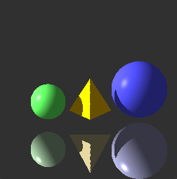

# Raytracer
Raytracer for computer graphic homework. This project only uses OpenGL for displaying pixel on the screen. 
The raytracing parts are all done by C++ for learning purpose. 

### Compile and Run the program
```
cd ~/raytracer
make
./raytracer
```
### Results

